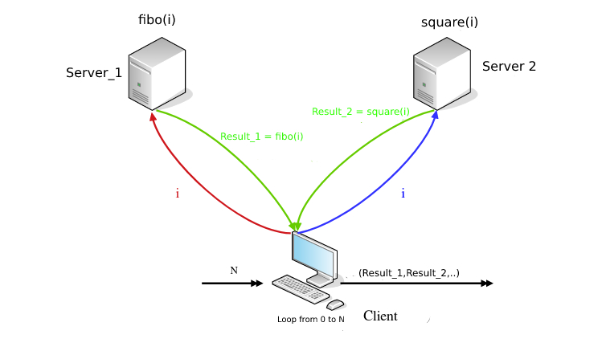

# Java_RMI

## Overview
In this project we have three machines, the first machine represents the client that reads an integer N and then sends values from 0 to N to the server1 and the server2. Server1 is responsible for computing the Fibonacci values of a given number and returning it back to the client. The server2 is responsible for calculating the square values of a given number and also returning it back to the client. These operations work concurrently.

## Example 
Let's say the client reads the number 5 as N, it sends 0 then 1, then 2...5, it will receive the Fibonacci numbers of these values and their squares at the same time.

## Deployment
In my case, I have an Ubuntu Linux distribution as an OS. Also, I have created two separate Windows 10 virtual machines. These 3 machines are connected over my home's LAN network, each one has its own IP address.

## How to run the project?
First of all, you must compile the code by entering the project directory and running the following command:

      javac *.java
      
After that you open a terminal (CMD in case you are using Windows) in each machine, for machine 1 and machine 2 you run server 1 and server 2

      java Server1
      java Server2
      
for machine 3 (client), you pass the IP addresses of the servers as arguments like this:

      java Client 192.168.1.9 192.168.1.25
      
in order to get the ip address of a specific server, you just need to open a terminal and type:

      ifconfig
or "ipconfig" in case you are using windows

